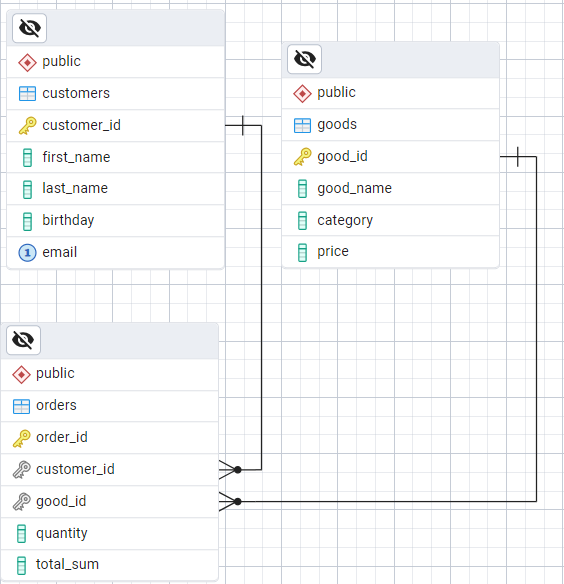

# 📊 Проект по анализу данных о продажах товаров (PostgreSQL)

## 🗂 Описание проекта

Этот проект представляет собой базу данных для хранения и анализа информации о продажах товаров в магазине. С помощью SQL и PostgreSQL реализована структура хранения клиентов, товаров и заказов, а также проведён первичный анализ данных, включающий суммарные продажи, категории товаров, поведение клиентов и частотность покупок.

## 🏗 Структура базы данных

Проект включает следующие таблицы:

- **customers** — информация о клиентах (ФИО, дата рождения, email).
- **goods** — данные о товарах (название, категория, цена).
- **orders** — заказы клиентов (связь с клиентами и товарами, количество, итоговая сумма).

## 📦 Схема базы данных

